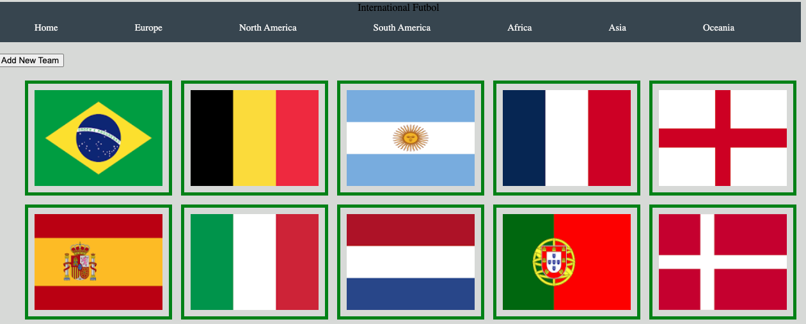
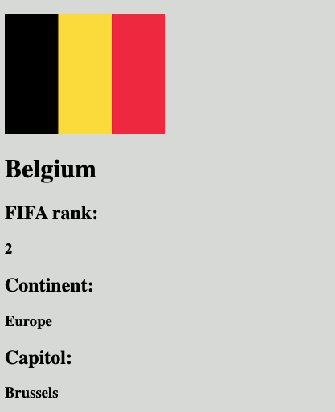

# International Futbol DB
### An express web app where users can find useful information about various FIFA teams and players.

## Technologies Used
* HTML5
* CSS3
* JavaScript
* Express
* EJS
* Mongoose/MongoDB
* Node.js

## Screenshots

## Check it out!!
[here](https://project2futboldb.herokuapp.com/teams) is the project!! Let me know what you think :)

## Next Steps
* One of the first steps is to continue to add remaining data. Currently the DB is rather empty.
* I want to add a second model for team players.
* I will make the links on the nav bar work and add better filtering functionality.